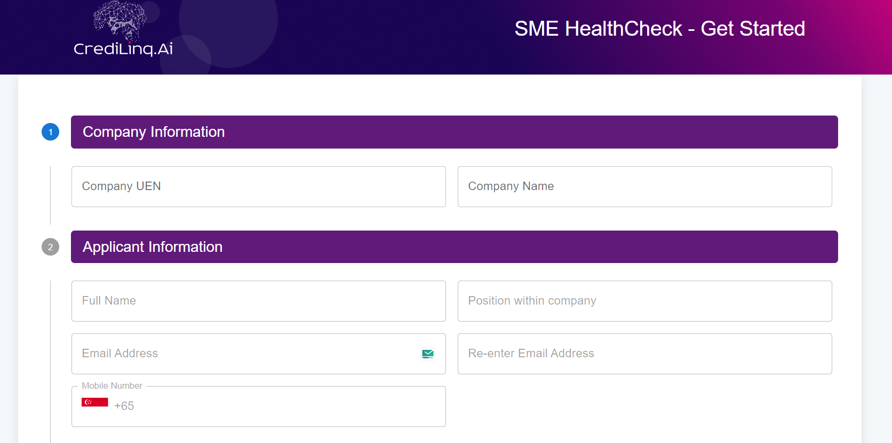

## Credelink SMEHealth page Demo

▲ Next.js 13.5.4
Nodejs 20.11.1

This is a [Next.js](https://nextjs.org/) project bootstrapped with [`create-next-app`](https://github.com/vercel/next.js/tree/canary/packages/create-next-app).

## Getting Started

First, run the development server:

```bash
npm run dev
# or
yarn dev
# or
pnpm dev
# or
bun dev
```

Open [http://localhost:3001](http://localhost:3001) with your browser to see the result.

API URL Backend server URL: http://localhost:300

## supported URLs
http://localhost:3001/applications
http://localhost:3001/


Used library
- Formik
- Yup
- Apollo client for GraphQL
- x-data-grid

